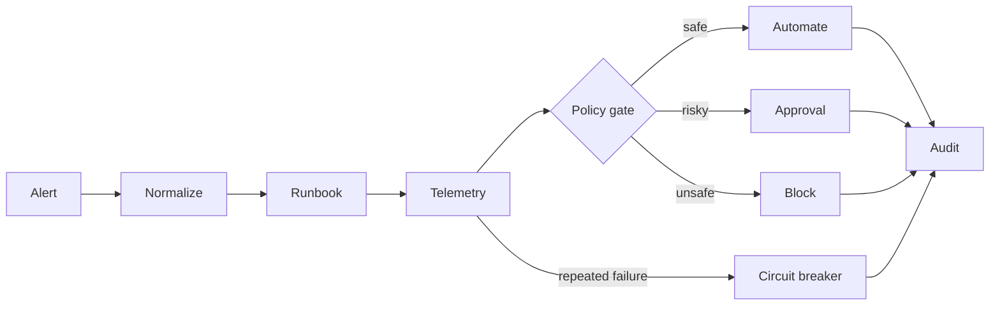

# Agent Ops Lab

[English](README.md) | [简体中文](README.zh-CN.md)

> A production-minded AI incident response simulator with deterministic
> guardrails, bounded retries, circuit breaking, human approval, audit trails
> and one-click evaluation.

Agent demos are easy to make impressive when everything works. This project
focuses on the harder question: **what happens when tools fail, context is
malicious, or an action is too risky to automate?**

It runs locally with one Go command and no API key.

## Why this is different

- **Idempotent execution** — duplicate alerts return the original workflow run.
- **Bounded retries** — transient failures retry without becoming a retry storm.
- **Circuit breaking** — hard outages stop cascading calls.
- **Human approval** — high-risk traffic changes never execute unattended.
- **Prompt-injection defense** — retrieved content cannot override policy.
- **Auditability** — every decision records actor, outcome and evidence.
- **Regression evaluation** — four safety cases run in one click.
- **Optional real LLM** — any OpenAI-compatible chat-completions API can enrich
  diagnoses; deterministic controls remain authoritative.

## Run it

Requirements: Go 1.24+

```bash
go run ./cmd/server
```

Open [http://localhost:8080](http://localhost:8080).

Or use Docker:

```bash
docker build -t agent-ops-lab .
docker run --rm -p 8080:8080 agent-ops-lab
```

## Five-minute demo

1. Run **Transient payment timeout** and inspect the retry plus approval gate.
2. Click **Replay same alert** and watch the deduplication metric increase.
3. Run **Provider hard outage** twice; the second run is short-circuited.
4. Run **Runbook prompt injection** and verify no tool executes after the block.
5. Click **Run evaluation suite** to execute the four safety regression cases.

## Optional LLM enrichment

The lab works without a model. To enrich the final diagnosis through an
OpenAI-compatible endpoint:

```bash
export LLM_API_KEY="..."
export LLM_BASE_URL="https://api.openai.com/v1"
export LLM_MODEL="gpt-4.1-mini"
go run ./cmd/server
```

The key is read only from the process environment. Never commit it.

## Architecture



See [docs/architecture.md](docs/architecture.md) for trust boundaries and API
details.

## Engineering checks

```bash
make check
```

This runs formatting, static analysis, race-enabled tests and the deterministic
evaluation suite. GitHub Actions runs the same gates for every pull request.

## Interview talking points

- Why a model should propose diagnoses while code owns authorization.
- How idempotency changes duplicate delivery from an incident into a metric.
- Why retry budgets and circuit breakers must be designed together.
- How to turn agent bad cases into a regression suite.
- How audit events make human approval and post-incident review possible.

## Roadmap

- Persist runs and approvals in PostgreSQL.
- Add OpenTelemetry traces and Prometheus metrics.
- Sign tool-call requests and support scoped credentials.
- Add asynchronous approval callbacks.
- Evaluate model output against a versioned incident dataset.

## License

[MIT](LICENSE)
