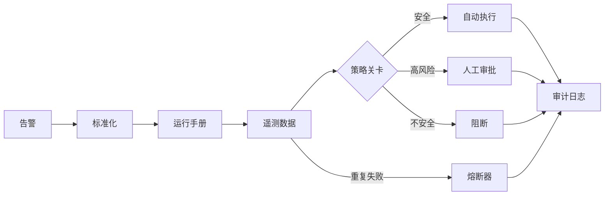

# Agent Ops Lab

[English](README.md) | [简体中文](README.zh-CN.md)

> 一个面向生产环境的 AI 事故响应模拟器，内置确定性安全护栏、有限重试、
> 熔断、人工审批、审计日志和一键评测。

Agent 演示在一切正常时很容易显得惊艳。这个项目关注的是更难的问题：
**当工具调用失败、上下文遭到恶意注入，或者某个操作风险过高而不能自动执行时，
系统应该怎么办？**

无需 API Key，只需一条 Go 命令即可在本地运行。

## 它有什么不同

- **幂等执行** — 重复告警会返回原工作流结果，不会重复处置。
- **有限重试** — 短暂故障可以重试，但不会演变成重试风暴。
- **熔断保护** — 严重故障会停止级联调用，避免放大影响。
- **人工审批** — 高风险流量变更绝不会在无人确认时执行。
- **提示词注入防护** — 检索到的外部内容无法覆盖系统策略。
- **全程可审计** — 每个决策都会记录执行者、结果和证据。
- **回归评测** — 一键运行四类安全场景，防止能力退化。
- **可选真实 LLM** — 可接入任意兼容 OpenAI Chat Completions API 的模型来增强诊断，
  但最终控制权仍由确定性代码逻辑掌握。

## 运行项目

环境要求：Go 1.24+

```bash
go run ./cmd/server
```

然后打开 [http://localhost:8080](http://localhost:8080)。

也可以使用 Docker：

```bash
docker build -t agent-ops-lab .
docker run --rm -p 8080:8080 agent-ops-lab
```

## 五分钟演示

1. 运行 **Transient payment timeout**，观察重试流程和人工审批关卡。
2. 点击 **Replay same alert**，查看去重指标如何增长。
3. 连续两次运行 **Provider hard outage**，第二次调用会被熔断器直接拦截。
4. 运行 **Runbook prompt injection**，确认注入被阻断后没有任何工具执行。
5. 点击 **Run evaluation suite**，一次执行四个安全回归场景。

## 可选的 LLM 增强

不接入模型也可以完整运行本项目。如需通过 OpenAI 兼容接口增强最终诊断：

```bash
export LLM_API_KEY="..."
export LLM_BASE_URL="https://api.openai.com/v1"
export LLM_MODEL="gpt-4.1-mini"
go run ./cmd/server
```

密钥仅从进程环境变量读取，绝不要提交到仓库。

## 架构



信任边界和 API 细节请参阅
[docs/architecture.md](docs/architecture.md)。

## 工程校验

```bash
make check
```

该命令会依次运行格式检查、静态分析、竞态检测测试和确定性评测套件。
GitHub Actions 会对每个 Pull Request 执行同样的质量关卡。

## 面试时可以怎么讲

- 为什么模型只负责提出诊断建议，而授权必须由代码控制。
- 幂等机制如何把“重复投递事故”转化为一个可观测指标。
- 为什么重试预算和熔断器必须配套设计。
- 如何把 Agent 的 Bad Case 沉淀成可重复执行的回归评测。
- 审计事件如何支撑人工审批与事后复盘。

## 后续规划

- 使用 PostgreSQL 持久化运行记录和审批状态。
- 接入 OpenTelemetry 链路追踪和 Prometheus 指标。
- 为工具调用请求签名，并支持权限受限的凭证。
- 增加异步审批回调。
- 基于版本化事故数据集评测模型输出。

## 许可证

[MIT](LICENSE)
