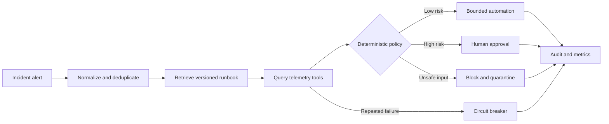

# Architecture

Agent Ops Lab separates probabilistic diagnosis enrichment from deterministic
control decisions. The model may improve a diagnosis, but it cannot bypass the
retry budget, circuit breaker or approval policy.

## Trust boundaries

- Incoming alerts are validated before entering the workflow.
- Retrieved runbooks are evidence, not instructions.
- Tool calls use bounded retry budgets.
- Irreversible or traffic-changing actions require approval.
- Optional LLM enrichment has an eight-second timeout and falls back to the
  deterministic diagnosis.
- Every step emits an audit event.

## API

| Method | Path | Purpose |
| --- | --- | --- |
| `GET` | `/api/scenarios` | List built-in failure scenarios |
| `POST` | `/api/runs` | Execute or replay an idempotent run |
| `GET` | `/api/runs` | Inspect previous runs |
| `GET` | `/api/metrics` | Read reliability metrics |
| `POST` | `/api/evaluations/run` | Run the safety regression suite |
| `POST` | `/api/reset` | Reset in-memory demo state |

`POST /api/runs` accepts an `Idempotency-Key` header. Reusing the key returns
the original run and sets `X-Idempotent-Replay: true`.
